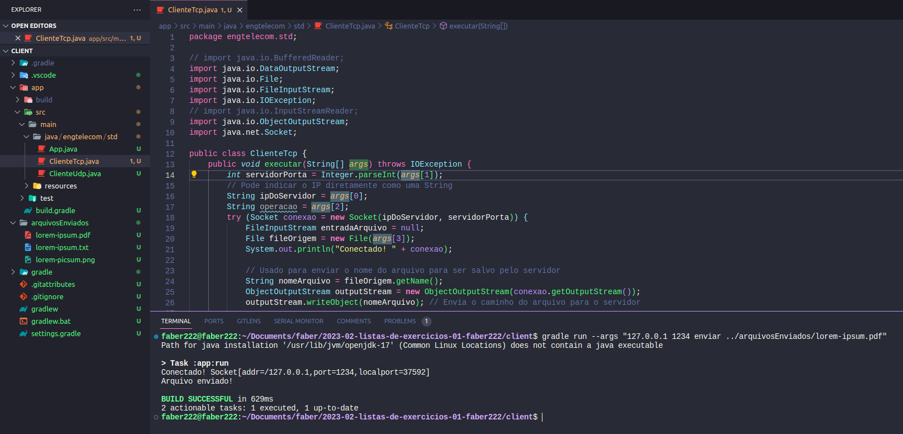
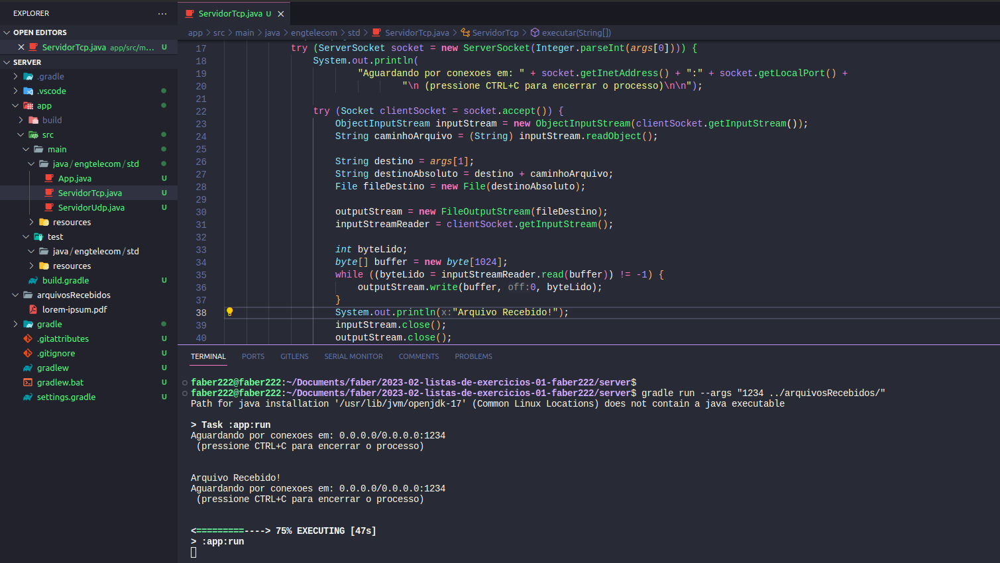

# Instruções de Uso e Execução da Aplicação Java com Gradle

## Requisitos
Certifique-se de que o Java e o Gradle estão instalados em seu sistema antes de executar a aplicação.

## Instruções de Execução do Cliente
1. Abra o terminal.
2. Navegue até o diretório raiz do projeto.
3. Execute o seguinte comando para compilar e executar a aplicação:

```bash
git clone https://github.com/STD29006-classroom/2023-02-listas-de-exercicios-01-faber222.git

cd STD29006-classroom/2023-02-listas-de-exercicios-01-faber222
cd client

gradle run --args "<ip> <porta> <operacao> <caminho/do/arquivo>"
```

## Executando o Servidor
1. Abra o terminal.
2. Navegue até o diretório raiz do projeto.
3. Execute o seguinte comando para compilar e executar o servidor:

```bash
git clone https://github.com/STD29006-classroom/2023-02-listas-de-exercicios-01-faber222.git

cd STD29006-classroom/2023-02-listas-de-exercicios-01-faber222
cd server

gradle run --args "<porta> <diretorio_de_destino>"
```

## Funcionamento do Cliente

Este código implementa um cliente TCP em Java que é capaz de enviar arquivos para um servidor específico. O programa utiliza argumentos de linha de comando para receber informações cruciais, como o endereço IP do servidor, a porta a ser utilizada, a operação desejada e o caminho do arquivo que se pretende enviar.

Ao executar o programa com os argumentos corretos, o cliente estabelece uma conexão com o servidor e envia o arquivo especificado. Ele primeiro envia o nome do arquivo para o servidor por meio de um ObjectOutputStream e, em seguida, envia o conteúdo do arquivo por meio de um DataOutputStream.

Durante a execução, o programa lida com possíveis exceções, como a desconexão inesperada do servidor. Além disso, o código garante o fechamento adequado de recursos para evitar vazamentos de memória ou conexões não fechadas.

Certifique-se de configurar e executar um servidor correspondente para receber os arquivos enviados pelo cliente. O programa pressupõe que o servidor está configurado e pronto para aceitar conexões.

## Funcionamento do Servidor

Este código implementa um servidor TCP simples em Java que aguarda conexões de clientes para receber arquivos. O programa utiliza argumentos de linha de comando para configurar a porta na qual o servidor deve aguardar por conexões e o diretório de destino para salvar os arquivos recebidos.

Ao executar o servidor, ele aguarda por conexões de clientes. Quando um cliente se conecta, o servidor lê o nome do arquivo a ser recebido por meio de um ObjectInputStream e, em seguida, recebe o conteúdo do arquivo por meio de um InputStream. O servidor grava os dados recebidos em um arquivo no diretório especificado.

O código é projetado para funcionar continuamente, aguardando e lidando com múltiplas conexões de clientes. Ele lida com exceções que podem surgir durante o processo de comunicação com o cliente e garante o fechamento adequado de recursos para evitar vazamentos de memória ou conexões não fechadas.

Certifique-se de executar o servidor em um ambiente adequado e configurado para receber conexões dos clientes. O servidor deve estar em execução antes de tentar se conectar a ele com o cliente.

## Passo a Passo da Conexão Cliente-Servidor

### 1. Inicialização do Servidor

O servidor é inicializado e aguarda por conexões de clientes em uma porta específica.

Exemplo de código do servidor (ServidorTcp.java):
```java
ServerSocket socket = new ServerSocket(Integer.parseInt(args[0]));
```
### 2. Conexão do Cliente com o Servidor

O cliente inicia uma conexão com o servidor, especificando o endereço IP e a porta do servidor.

Exemplo de código do cliente (ClienteTcp.java):
```java
Socket conexao = new Socket(ipDoServidor, servidorPorta);
```

### 3. Troca de Informações

O cliente envia o nome do arquivo para o servidor, seguido pelo conteúdo do arquivo.

Exemplo de código do cliente (ClienteTcp.java):
```java
ObjectOutputStream outputStream = new ObjectOutputStream(conexao.getOutputStream());
outputStream.writeObject(nomeArquivo);
```

### 4. Recebendo Informações no Servidor

O servidor lê o nome do arquivo enviado pelo cliente e cria um arquivo correspondente no diretório especificado.

Exemplo de código do servidor (ServidorTcp.java):
```java
ObjectInputStream inputStream = new ObjectInputStream(clientSocket.getInputStream());
String caminhoArquivo = (String) inputStream.readObject();
```

### 5. Transferência de Dados

O cliente envia os dados do arquivo para o servidor, que os recebe e grava no arquivo criado.

Exemplo de código do cliente (ClienteTcp.java):
```java
saida.write(buffer, 0, byteLido);
```
Exemplo de código do servidor (ServidorTcp.java):
```java
outputStream.write(buffer, 0, byteLido);
```
### 6. Encerramento da Conexão

Após a transferência bem-sucedida, o cliente e o servidor encerram a conexão adequadamente.

Exemplo de código do cliente (ClienteTcp.java):
```java
outputStream.close();
entradaArquivo.close();
```
Exemplo de código do servidor (ServidorTcp.java):
```java
inputStream.close();
outputStream.close();
```

## Requisitos atendidos

- [X] Conexão Cliente ao Servidor
- [X] Multithread do Servidor
- [ ] Função de Download
- [ ] Função de Download com verificação de existência
- [X] Função de Upload
- [X] Função de Upload com verificação de existência
- [X] Passar informações como argumento de linha de comando
- [ ] Arquivo UML


## Imagens do programa
Conexão e envio de arquivo pelo client



Conexão e recebimento de arquivo pelo server


Notem que a pasta arquivosRecebidos do server contêm o mesmo arquivo da pasta arquivosEnviados do client, indicando que o envio ocorreu.